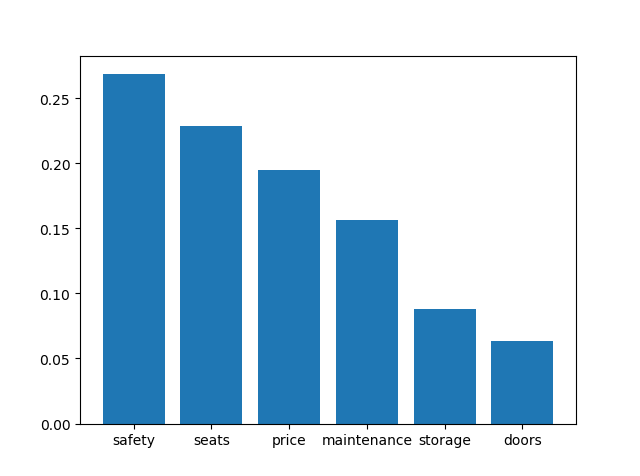
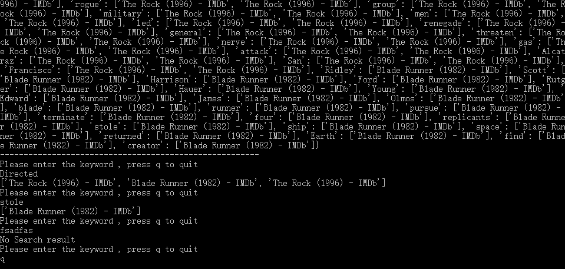
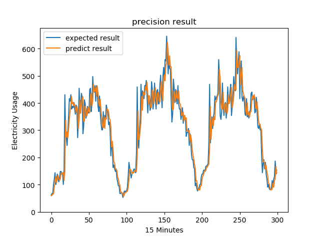
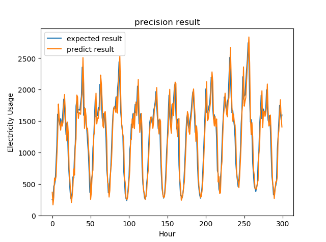

# code_collection 

Here are some of past take-home projects that can be shared without violating NDA

| company name | link |
|--------------|------|
| [wave](https://www.waveapps.com/) | [wave-payroll-challenges](./wave-hq-take-home-projects/)   |
| [TextIQ](https://www.relativity.com/data-solutions/textiq/)       | [textiq-sorting-visualize](./textiq-takehome-project/)    |
| a stealth startup that no longer operate   | [extract-info-from-docs-with-python](./stealth-xml-windows-docx-conversion/)    |

I also worked on [advent of code](https://adventofcode.com/) in the past years

[advent of code 2021](./advent_of_code/2021/)

[advent of code 2022](./advent_of_code/2022/)

[advent of code 2023](./advent_of_code/2023/)

[advent of code 2024](./advent_of_code/2024(python)/)

---

Here are python implementations for different ML/data-mining projects

[Apriori-FP](Machine-Learning-Code-Base/Apriori-FP)

[Spark-emotion-analysis](Machine-Learning-Code-Base/bigdata)

[Data Visualization with Tableau](Machine-Learning-Code-Base/BI_Tableau)

[Keras CNN for image classfier](Machine-Learning-Code-Base/keras_cnn.py) 

[Retrieve tweets via API](Machine-Learning-Code-Base/twitter_news.py)

[Random Forest Tree && Decision Tree](Machine-Learning-Code-Base/Decision-Tree)

[Inverted Index](Machine-Learning-Code-Base/build_search_engine.py) for implementing a 100+ lines nlp-based IMBD search engine with web crawlers from scratch

[Prediction Algorithm](Machine-Learning-Code-Base/prediction) including `Linear Regression && SVM && NN && Time Series`

