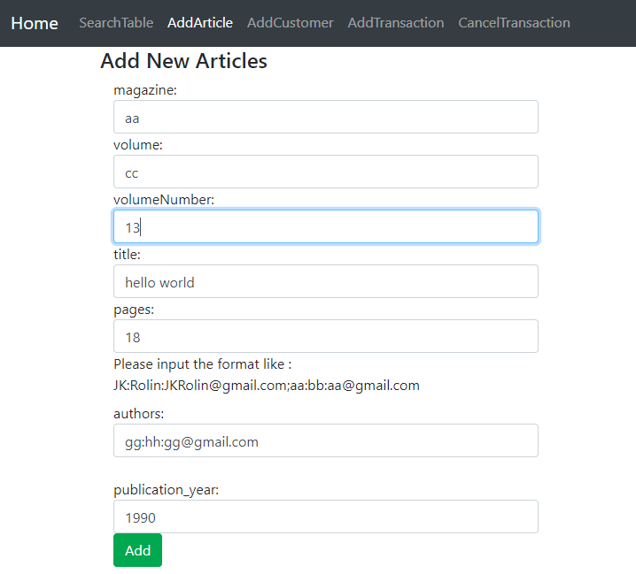
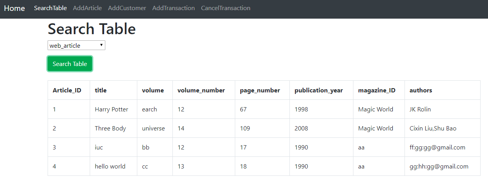
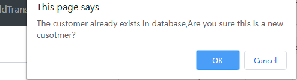
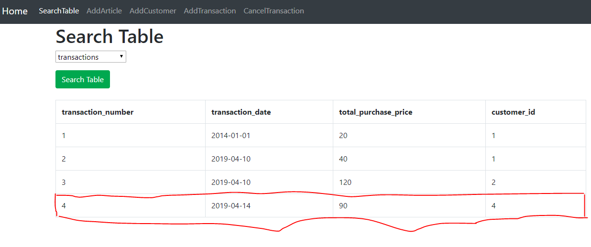
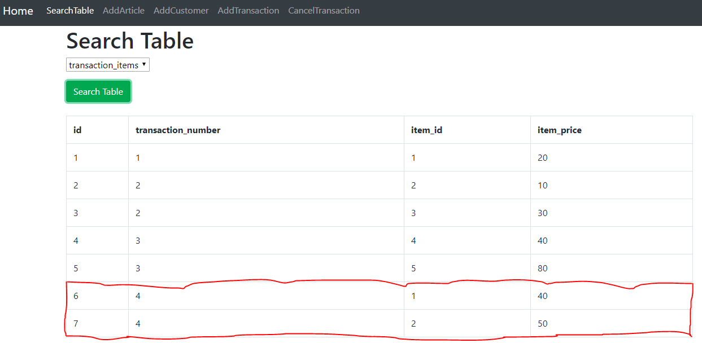
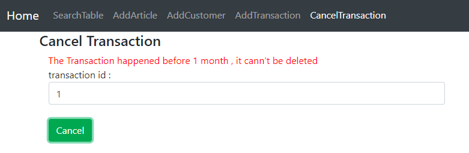

#### What is this ?

这是最近的一个小项目，大约是 CRUD 级别，但很好地展现了 Spring Boot 的特点

#### 参考：

1. 完全前后端分离，Spring 提供后端 `json API`，前端由纯 `HTML+CSS+Jquery` 组成
2. 技术栈包括 `Spring Boot + Spring MVC + Spring Data JPA` ，其中 JPA 不负责生成数据库表(`auto-ddl=none`)，
   所有表由建表脚本构成，JPA 只起到映射作用.一些 JPA 无法完成的功能由 JDBC Template 执行查询
3. 不包含外键，数据一致性由代码逻辑保证. `transaction` 与 `items` 的关系会保存在中间表 `transaction_items` 中

#### 要求：

1. `Show table`：要求输入一个表的名称，返回表的所有字段并展示。实际会返回数据库里的所有表并展示在一个下拉列表里
2. `Add New Article`: 添加一个新的文章(包括 `title/magazine/volume number/pages/authors`)，存在一些验证需求
3. `Add new Customer`: 添加一个新的消费者(包括 `lname/fname/phone number/mailing address`)。如果存在同名情况
   需要确认这是否是一个新的客户
4. `Add New Transaction`: 添加一个新的交易(包括 customer ID 与 item 的 id 与 price)。其中会要求用户有一个 discount_code
(折扣码)字段。用户最终交易需要支付的价格为：`Sum*(1-2.5*DC/100)`，其中 DC 计算方法为：得到过去五年内该用户的消费记录，在 0-100 之间则
DC 为 0，在 100-200 之间则为 1，依此类推对消费额大于 500 的用户折扣码为 5
5. `Cancen Transaction`: 输入 Transaction Number ，如果该交易发生于一个月内则支持取消，并返回所有可以取消的交易

#### 执行：

1. 新建数据库并执行 `existing_tables.sql` 与 `new_tables.sql`文件，创建数据表
2. 修改 `application.properties` 里的配置变量
3. a. 如果想通过源码执行，只需要导入 `Intellij IDEA/Eclipse` 后解析依赖并执行程序

   b. 如果想通过 jar 包执行，在命令行里输入 `java -Dspring.config.location=application.properties -jar Application.jar` 
4. 打开 `index_html`

部分截图：

