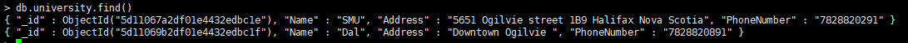

1. in-place validation  
  I implement it by jquery-validation and some customized functions

2. Four $.post in client javascript and Four app.post in server javascript 

3. Use mongo db for data operations (only your id in databa)

