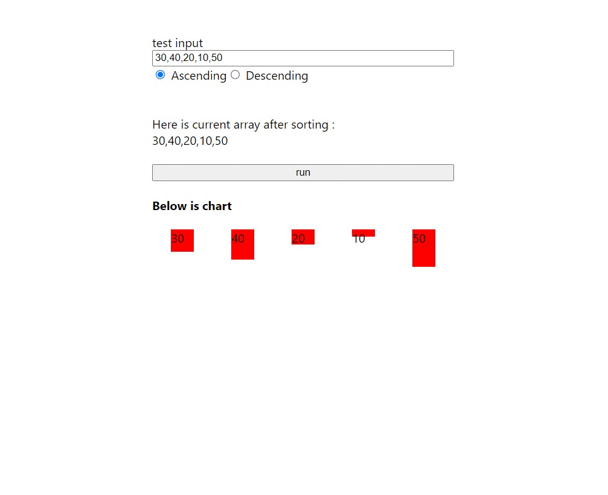

### requirements

You're give 3 hours to build a front-end application to visualize sorting algorithm with any frameworks you like

Via this web app, the user should be able to:

1. enter an array to be sorted.
2. choose if the array should be sorted in ascending or descending order.
3. Use Bubble sort as the sorting algorithm.
4. advance the sorting of the array one step
5. For example, if the current array is (1, 4, 2, 5, 8). Using Bubble sort, the next step
should be (1, 2, 4, 5, 8).
6. Allow the user to advance one step by clicking a UI button or pressing a key.
7. If the array is already in the correct order, disable this functionality.

Bonus
As the array is being sorted, animate the transitions to better help the user understand what is
happening.

---

### Implementation 

The FE framework is react. There are 3 components:

- ArrayInput to handle the user input

- ArrayChart to generate the square chart based on array

- Sort that implements the bubble sort function. Othe sorting method(eg quicksort) can be added in this part w/ the same input&output.

---

Demo:

